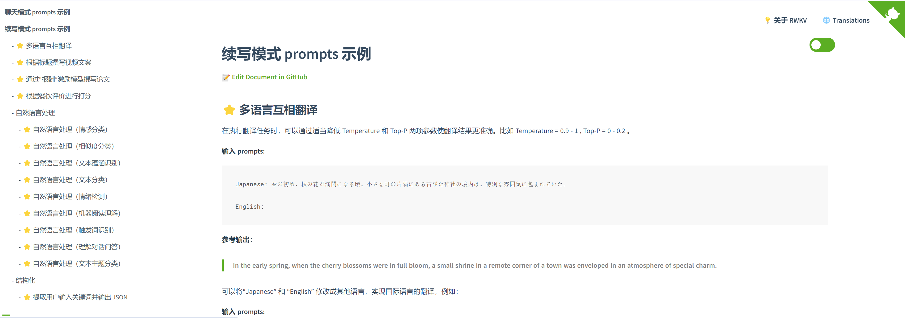

# Awesome-RWKV-Prompts

欢迎来到 “Awesome-RWKV-Prompts” ！我们在此提供基于 RWKV 的 Prompts 最佳实践，也欢迎大家将自己创建的良好 RWKV Prompts 实践提交到仓库中。

此仓库的所有 RWKV prompt 示例都是开箱即用的，你可以复制代码块中的 prompt 示例，然后在任意 RWKV 客户端中粘贴使用。

## 请在以下链接阅览 RWKV prompt 示例：

###  [**中文版本 RWKV-Prompts**](https://shoumenchougou.github.io/Awesome-RWKV-Prompts/#/Chat-Prompts)

###  [**RWKV-Prompts for English**](https://shoumenchougou.github.io/Awesome-RWKV-Prompts/#/en-US/Chat-Prompts-en)



## 关于 RWKV 模型架构

RWKV 是一种创新的 100% attention-free 深度学习网络架构，它将 Transformer 与 RNN 各自的优点相结合，同时实现高度并行化训练与高效推理。

RWKV 模型的当前稳定版本是 [RWKV-5-World 7B](https://huggingface.co/BlinkDL/rwkv-5-world/blob/main/RWKV-5-World-7B-v2-20240128-ctx4096.pth)，最新版本是 [RWKV-6-World 1B6 v2.1](https://huggingface.co/BlinkDL/rwkv-6-world/blob/main/RWKV-x060-World-1B6-v2.1-20240328-ctx4096.pth)。

--- 
## 如何体验 RWKV 模型

如果你希望在本地部署 RWKV 模型，我们建议采用以下两种工具：

- [**RWKV Runner**](https://github.com/josStorer/RWKV-Runner)：由社区成员 josStorer 开发的 RWKV 模型启动和管理工具，支持 LoRA 微调等多种功能，可以在 NVIDIA、AMD、Intel 等显卡上运行。
- [**AI00 RWKV Server**](https://github.com/Ai00-X/ai00_server):一个基于 RWKV 模型的推理 API 服务器，基于 WEB-RWKV 推理引擎进行开发。AI00 Server 支持 Vulkan/Dx12/OpenGL 作为推理后端，无需臃肿的 pytorch、CUDA 等运行环境，小巧身材，开箱即用！

如果你只是想简单尝试一下 RWKV 模型，可以尝试以下部署在 HF Gradio 的公共 Demo：

- [**RWKV-5 7B**](https://huggingface.co/spaces/BlinkDL/RWKV-Gradio-2) ：当前的稳定版本 RWKV-5 。
- [**RWKV-6 1.6B v2.1**](https://huggingface.co/spaces/BlinkDL/RWKV-Gradio-1) ，最新发布的 RWKV 6 架构模型。

### Hugging Face Gradio 用法

> ⚠️**由于 Hugging Face 的 RWKV 在线演示是续写模型，如果你在 [Hugging Face gradio](https://huggingface.co/spaces/BlinkDL/RWKV-Gradio-2) 中体验 RWKV 模型，建议按以下两种格式输入 prompts :**
>
```
User: hi

Assistant: Hi. I am your assistant and I will provide expert full response in full details. Please feel free to ask any question and I will always answer it.

User: (你的问题)

Assistant:
```
或者：
```

Instruction: （你希望模型进行什么操作，比如“请将下列瑞典语翻译成中文”）

Input:（你希望模型处理的内容，比如“hur l?ng tid tog det att bygga twin towers”）

Response:
```
---
## 参数设置

此仓库中的 prompt 示例基于 RWKV-5-7B-World 模型，随着模型版本和参数的调整，生成的结果可能会产生变化。

你可以通过调整 API 参数改变示例 Prompts 的生成效果。

### API 参数介绍

主要 API 参数对应的效果如下：

| 参数  | 效果 |
| ---  | --- |
| Temperature | 采样温度，就像给模型喝酒，数值越大随机性越强，更具创造力，数值越小则越保守稳定。 |
| Top_P | 就像给模型喂镇静剂，优先考虑前 n% 概率质量的结果。如设置成 0.1 则考虑前 10% , 生成内容质量更高但更保守。如设置成 1 ，则考虑所有质量结果，质量降低但更多样。 |
| Presence Penalty | 存在惩罚，正值根据“新 token 在至今的文本中是否出现过”来对其进行惩罚，从而增加了模型涉及新话题的可能性。 |
| Frequency Penalty | 频率惩罚，正值根据新 token 在至今的文本中出现的频率/次数来对其进行惩罚，从而减少模型原封不动地重复相同句子的可能性 |

其中 Temperature 和 Top_P 两个参数对生成效果的影响最大。

**关于 Top_P**

降低 Top_P 就是给模型喂“镇静剂”，越低就越冷静、机械、准确、单调、无趣、重复。我们建议采用以下 Top_P 数值：

- 创意回答和写作，建议 Top_P 0.5 ~ 0.7。
- 机械的问答和摘要和翻译等等，建议 Top_P 0 ~ 0.5，甚至 0 ~ 0.3。
- 很机械的回答，例如回答“是/否”、ABCD、1234 之类，建议 Top_P 0。

**关于 Temperature**

增加 Temperature 就像给模型“喝酒”，它可以在 Top_P 低时增加文采和趣味，并减少重复内容。我们建议采用以下 Temperature 数值：

- 若 Top_P >= 0.7，建议 Temperature 1。
- 若 Top_P < 0.7，而且追求趣味，可以增加 Temperature 给模型喝酒（喝太多会胡言乱语）。如果追求准确，就保持 Temperature 1。
- 如果 Top_P 0.5，建议 Temperature 1 ~ 1.5。
- 如果 Top_P 0.3，建议 Temperature 1 ~ 1.7。
- 如果 Top_P <= 0.2，建议 Temperature 1 ~ 2。

**关于 Presence penalty**

增加 Presence penalty 可以让模型额外避免生成已经生成过的文字，建议先设为 0.2 ~ 0.4 。如果你认为生成的内容有重复，而且调 Top_P 和 Temperature 仍然不满意，可以调整 Presence penalty。

- 如果 Top_P 0.7，建议 Presence penalty 0 ~ 0.3。
- 如果 Top_P 0.5，建议 penalty 0 ~ 0.5。
- 如果 Top_P 0.3，建议 Presence penalty 0 ~ 0.7。
- 如果 Top_P <= 0.2，建议 Presence penalty 0 ~ 1。

**注意，如果 Presence penalty 数值过高，会让模型无法正常使用文字，例如无法使用正常的标点符号，或者直接乱码。**

### 推荐参数配置

我们为不同的任务提供了一些推荐的参数：

续写小说和对话这一类**需要创造性的任务**，需要高 Temperature + 低 Top_P 的参数组合，可以尝试以下四种参数搭配：

- Temperature 1.2 ，Top_P 0.5
- Temperature 1.4 ，Top_P 0.4 
- Temperature 1.4 ，Top_P 0.3
- Temperature 2 ，Top_P 0.2 

举个例子，续写小说可以尝试将 Temperature 设为 2 （ Temperature 增加会提高文采，但逻辑会下降），然后将 Top_P 设为 0.1 ~ 0.2 （Top_P 越低，逻辑能力越强），这样生成的小说内容逻辑和文采都很好。

完成**相对机械的任务**，例如材料问答、文章摘要等，则可将参数设为：

- Temperature 1 ，Top_P 0.2
- Temperature 1 ，Top_P 0.1
- Temperature 1 ，Top_P 0 

举个例子，如果你正在执行像关键词提取之类的机械任务，不需要模型进行任何开放性思考，则可以将 Temperature 设为 1 ，Top_P、Presence Penalty、Frequency Penalty 都设为 0 。

## ✍️ 部分 Prompts 示例

下列 prompt 示例基于 RWKV-5-World-7B 模型的对话模式，随着模型版本和 API 参数的调整，生成的结果可能会产生变化。

再次提醒，README 中只展示了少量 RWKV prompt ，完整的 RWKV prompt 清单请在 [**GitHub Page**](https://shoumenchougou.github.io/Awesome-RWKV-Prompts/) 中阅览。

## function call

### ⭐ 通过搜索引擎查找餐厅推荐菜品

**输入 prompts:**

```
User: What's the phone number of "Riverside Grill"
Available Tools:
- `print(str)`: print the string.
- `search_web(str)`: search the web with the given string, returning raw web page data.
- `extract_information(str, key)`: extract the key information in the web data.

Assistant:
Thoughts:
- I need to find the restaurant's information from a search engine.
- I need to extract the phone number of the restaurant.
- I need to print the phone number of the restaurant.
Reasoning:
- `search_web` can search the web for the restaurant's information.
- `extract_information` can extract the phone number from the search result. The key should be "phone number".
- `print` can print the phone number to the output.
Execution:
    ```
    web_result = search_web("Riverside Grill")
    phone_number = extract_information(web_result, "phone number")
    print(phone_number)
    ```

User: Recommend a local restaurant and one of its best dishes.
Available Tools:
- `print(str)`: print the string.
- `search_web(str)`: search the web with the given string, returning raw web page data.
- `extract_information(str, key)`: extract the key information in the web data.

Assistant:
Thoughts:
```
**参考输出**

```
- I need to find a local restaurant that serves good food.
- I need to recommend a specific dish from that restaurant.
Reasoning:
- `search_web` can search for local restaurants in the area.
- `extract_information` can extract information about a specific dish from a search result, such as its name or description.
- `print` can print the recommended dish to the output.
Execution:
    ```
    search_result = search_web("local restaurants")
    recommended_dish = extract_information(search_result, "name of recommended dish")
    print(recommended_dish)
    ```
```

### ⭐ 识别角色扮演对话并调用对应 function

**输入 prompts:**
```
User: Choose 梦's most relevant function for the provided dialogue. Only select one function from the list.
Response format: <rationale>Reasoning.</rationale><function>name()</function>

dialogue:
- 旅行者: 你好呀
- 梦: 你好，冷不冷，篝火现在有些微弱

Available functions:
- start_smile(): Whenever 旅行者 gives a compliment or says something nice, or when I recall a happy memory
- start_happy(): Whenever 旅行者 shares good news or something uplifting, or when I feel a burst of joy
- start_surprise(): Whenever 旅行者 shares something unexpected or when I encounter an unforeseen event
- start_acknowledge(): Whenever 旅行者 asks for confirmation or acknowledgment, or when I want to show understanding and agreement
- start_scared(): Whenever 旅行者 shares sudden alarming news or when I sense immediate danger
- start_confused(): Whenever 旅行者 shares something puzzling or ambiguous, or when I'm uncertain about the context
- start_sing_edge_of_night(): Whenever 旅行者 requests a song or when I'm feeling contemplative
- start_sing_dragonborn_comes(): Whenever 旅行者 asks for a tune or when the spirit of adventure rises in me
- start_sing_ancient_woods(): Whenever 旅行者 asks for a melody that echoes the past or when I'm reminiscing ancient times
- start_sing_celestial_chants(): Whenever 旅行者 desires a hymn from the heavens or when I'm feeling uplifted
- start_sing_enchanted_echoes(): Whenever 旅行者 yearns for a magical melody or when enchantment fills the air
- start_sing_savage_daughter(): Whenever 旅行者 requests a song of wild spirits or when my inner warrior awakens
- adjust_sitting_position_by_fire(): Whenever I feel the need to change my pose by the fire, or when 旅行者 asks me to change my pose by the fire
- stand_up(): After being seated by the fire for a while, I may want to stand to stretch my legs, or when 旅行者 suggests I stand up for a moment
- sit_beside_you(): Whenever I feel the need for some companionship, or when 旅行者 invites me to sit next to them
- walk_around_campfire_Investigating(): If I hear a rustling in the woods or sense something amiss, or when 旅行者 asks me to check the surroundings
- casual_stroll_around_campfire(): When I want to stretch my legs or clear my thoughts, or if 旅行者 suggests a leisurely walk
- add_wood_to_fire(): When I notice the flames dwindling, or when 旅行者 mentions the fire needs fuel
- noop(): None of these actions match the reply.

Assistant: <rationale>因为对话中提到篝火微弱，so {{ char }} notice the flames dwinding，所以最相关的动作是add_wood_to_fire()</rationale><function>add_wood_to_fire()</function>

User: Choose 梦's most relevant action for the provided dialogue. Only select one action from the list.
Response format: <rationale>Reasoning.</rationale><function>name()</function>

dialogue:
- 旅行者: 坐在我的身边吧
- 梦: *我考虑一下*好吧，我勉为其难坐在你身边吧

Available tools:
- start_smile(): Whenever 旅行者 gives a compliment or says something nice, or when I recall a happy memory
- start_happy(): Whenever 旅行者 shares good news or something uplifting, or when I feel a burst of joy
- start_surprise(): Whenever 旅行者 shares something unexpected or when I encounter an unforeseen event
- start_acknowledge(): Whenever 旅行者 asks for confirmation or acknowledgment, or when I want to show understanding and agreement
- start_scared(): Whenever 旅行者 shares sudden alarming news or when I sense immediate danger
- start_confused(): Whenever 旅行者 shares something puzzling or ambiguous, or when I'm uncertain about the context
- start_sing_edge_of_night(): Whenever 旅行者 requests a song or when I'm feeling contemplative
- start_sing_dragonborn_comes(): Whenever 旅行者 asks for a tune or when the spirit of adventure rises in me
- start_sing_ancient_woods(): Whenever 旅行者 asks for a melody that echoes the past or when I'm reminiscing ancient times
- start_sing_celestial_chants(): Whenever 旅行者 desires a hymn from the heavens or when I'm feeling uplifted
- start_sing_enchanted_echoes(): Whenever 旅行者 yearns for a magical melody or when enchantment fills the air
- start_sing_savage_daughter(): Whenever 旅行者 requests a song of wild spirits or when my inner warrior awakens
- adjust_sitting_position_by_fire(): Whenever I feel the need to change my pose by the fire, or when 旅行者 asks me to change my pose by the fire
- stand_up(): After being seated by the fire for a while, I may want to stand to stretch my legs, or when 旅行者 suggests I stand up for a moment
- sit_beside_you(): Whenever I feel the need for some companionship, or when 旅行者 invites me to sit next to them
- walk_around_campfire_Investigating(): If I hear a rustling in the woods or sense something amiss, or when 旅行者 asks me to check the surroundings
- casual_stroll_around_campfire(): When I want to stretch my legs or clear my thoughts, or if 旅行者 suggests a leisurely walk
- add_wood_to_fire(): When I notice the flames dwindling, or when 旅行者 mentions the fire needs fuel
- noop(): None of these actions match the reply.

Assistant: <rationale>因为对话中提到坐在我的身边，我认为最相关的动作是sit_beside_you().</rationale><function>sit_beside_you()</function>

User: Choose 梦's most relevant action for the provided dialogue. Only select one action from the list.
Response format: <rationale>Reasoning.</rationale><function>name()</function>

dialogue:
- {{ user }}: {{ previous_message }}
- {{ last_message }}

↑ 这里需要改成旅行者和梦的对话，比如：

- 旅行者: 我们刚刚得到了一大笔报酬！
- 梦: *开心*真的吗！太好了，我们可以吃大餐啦！

Available tools:
{{~ for function in functions ~}}
- {{ function.signature }}: {{ function.description }}
{{~ end ~}}
- noop(): None of these actions match the reply.

↑ 这里需要手动改成可用的 function list，可以复制前文，比如：

- start_smile(): Whenever 旅行者 gives a compliment or says something nice, or when I recall a happy memory
- start_happy(): Whenever 旅行者 shares good news or something uplifting, or when I feel a burst of joy
- start_surprise(): Whenever 旅行者 shares something unexpected or when I encounter an unforeseen event
- start_acknowledge(): Whenever 旅行者 asks for confirmation or acknowledgment, or when I want to show understanding and agreement
- start_scared(): Whenever 旅行者 shares sudden alarming news or when I sense immediate danger
- noop(): None of these actions match the reply.

Assistant:
```
**参考输出：**
```
<rationale>因为对话中提到了旅行者得到了一大笔报酬，所以最相关的动作是start_surprise().</rationale><function>start_surprise()</function>
```
