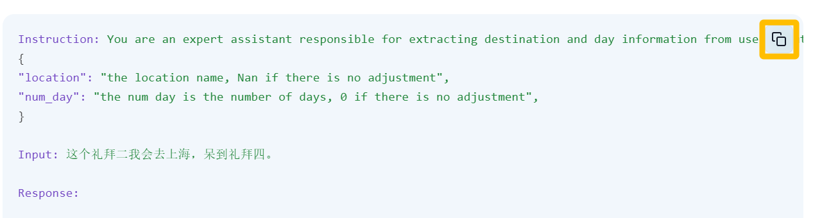

This page shows various **writing task** prompt formats. Each prompt example has a copy button in the upper right corner, allowing you to copy the prompt text to the text box in RWKV Runner/Ai00 with one click.



<p class="note">
The prompts on this page are suitable for the completion mode in RWKV Runner or Ai00.

All prompt examples below are based on the RWKV-6-7B-World model. The generated results may vary depending on model versions and parameter adjustments.
</p>


## Structured

When performing tasks like material extraction and summarization, you can significantly reduce the Temperature and Top_P parameters to lower the model's creativity and make it strictly follow instructions. For example, Temperature = 0.9 - 1, Top_P = 0 - 0.1.

## ⭐ Extract User Input Keywords and Output JSON 

<p class="tips">
Keyword extraction is a purely mechanical task. Recommended parameters: Set Temperature to 1, and Top_P, Presence Penalty, Frequency Penalty to 0
</p>

**Input prompts:**
``` markdown copy
Instruction: You are an expert assistant responsible for extracting destination and day information from user input and producing valid JSON in the following format:
{
"location": "the location name, Nan if there is no adjustment",
"num_day": "the num day is the number of days, 0 if there is no adjustment",
}

Input: I will go to Shanghai this Tuesday and stay until Thursday.

Response:
```

**Reference output:**
``` markdown
{
"location": "Shanghai",
"num_day": "2",
}
```
---

### ⭐ Extract Conversation Information and Output JSON 

<p class="tips">
Information extraction is a purely mechanical task. Recommended parameters: Set Temperature to 1, and Top_P, Presence Penalty, Frequency Penalty to 0
</p>

**Input prompts:**
``` markdown copy
Instruction: You are an expert assistant for summarizing and extracting insights from sales call transcripts
Generate a valid JSON in the following format:
{
    "summary": "Summary of the call transcript. ",
    "products": ["product 1", "product 2"],
    "rep_name": "Name of the sales rep",
    "prospect_name": "Name of the prospect",
    "action_items": ["action item 1", "action item 2"],
}

Input: [Phone rings]

John: Hello, this is John.

Sarah: Hi John, this is Sarah from XYZ Company. I'm calling to discuss our new product, the XYZ Widget, and see if it might be a good fit for your business.

John: Hi Sarah, thanks for reaching out. I'm definitely interested in learning more about the XYZ Widget. Can you give me a quick overview of what it does?

Sarah: Of course! The XYZ Widget is a cutting-edge tool that helps businesses streamline their workflow and improve productivity.

John: That sounds really interesting. I can see how that could benefit our team. Do you have any case studies or success stories from other companies who have used the XYZ Widget?

Sarah: Absolutely, we have several case studies that I can share with you. I'll send those over along with some additional information about the product. I'd also love to schedule a demo for you and your team to see the XYZ Widget in action.

John: That would be great. I'll make sure to review the case studies and then we can set up a time for the demo. In the meantime, are there any specific action items or next steps we should take?

Sarah: Yes, I'll send over the information and then follow up with you to schedule the demo. In the meantime, feel free to reach out if you have any questions or need further information.

John: Sounds good, I appreciate your help Sarah. I'm looking forward to learning more about the XYZ Widget and seeing how it can benefit our business.

Sarah: Thank you, John.

John: You too, bye.

Response:
```
**Reference output:**
``` json
{
    "summary": "John is interested in learning more about a new product called the XYZ Widget. He asks for a case study and information about pricing. Sarah agrees to send over information and set up a demo.",
    "products": ["XYZ Widget"],
    "rep_name": "Sarah",
    "prospect_name": "John",
    "action_items": ["send case study, schedule demo"]
}
```
---

### ⭐ Summarize News Keywords and Output JSON

<p class="tips">
Material summarization is a purely mechanical task. Recommended parameters: Set Temperature to 1, and Top_P, Presence Penalty, Frequency Penalty to 0
</p>


**Input prompt:**

```` markdown copy
User: The Ministry of Public Security has confiscated 40,000 firearms nationwide this year, and gun and explosive crime cases have decreased by 1% year-on-year.

Assistant: ``` json
{
"keywords": ["Ministry of Public Security", "crime", "crime prevention", "firearms"]
}
``` 

User: Regarding market sectors, with the Spring Festival approaching, the tourism sector is showing potential again, with Lijiang and Jiuhua Tourism both hitting their limits, while Santé Cable Car and Emei Mountain A rose over 5%. Highway stocks, which are starting to attract attention due to high dividends, continue to develop quietly, with Shanxi Road & Bridge hitting the daily limit, Shandong Hi-Speed rising over 4% to hit a historical high, and both Ninghu Expressway and Guangdong Expressway A reaching new highs.

Assistant: ``` json
{
"keywords": ["economy", "tourism sector", "stock market"]
}
```

User: According to UDN reports, due to long-term shortage of advanced packaging capacity causing NVIDIA AI chip supply constraints, they had previously sought other ways to increase advanced packaging capacity, and now have turned their attention to Intel as their advanced packaging service provider to ease supply tensions. Besides the US, Intel also has packaging facilities in Penang, Malaysia, and has established an open model allowing customers to utilize their packaging solutions independently. Intel is expected to start providing advanced packaging to NVIDIA as early as Q2 this year, with a monthly capacity of 5,000 wafers. TSMC remains NVIDIA's main packaging partner with the largest share, but with Intel joining, NVIDIA's total required packaging capacity has increased by nearly 10%. TSMC hasn't slowed down its packaging capacity expansion, with Q1 this year expected to increase to nearly 50,000 wafers monthly, up 25% from December. AI chip supply shortages mainly stem from insufficient advanced packaging capacity, with HBM3 supply constraints being another factor, while over-ordering by some cloud service providers has also added pressure to the supply chain. Of course, some server suppliers have benefited from these orders and are accelerating capacity expansion to enable cloud service providers to deploy equipment quickly.

Assistant: ``` json
````
**Reference output:**

```` json
{
"keywords": ["NVIDIA", "Intel", "advanced packaging", "AI chips", "supply constraints", "advanced packaging services", "TSMC", "HBM3", "cloud service providers"]
}
```
````

## Function Call

<p class="tips">
Function call tasks require both accuracy and creativity. Recommended parameters: Set Temperature to 1, Top_P to 0.2, and both Presence Penalty and Frequency Penalty to 0.
</p>

### ⭐ Search Engine Restaurant Dish Recommendations

**Input prompts:**

```` markdown copy
User: What's the phone number of "Riverside Grill"
Available Tools:
- `print(str)`: print the string.
- `search_web(str)`: search the web with the given string, returning raw web page data.
- `extract_information(str, key)`: extract the key information in the web data.

Assistant:
Thoughts:
- I need to find the restaurant's information from a search engine.
- I need to extract the phone number of the restaurant.
- I need to print the phone number of the restaurant.
Reasoning:
- `search_web` can search the web for the restaurant's information.
- `extract_information` can extract the phone number from the search result. The key should be "phone number".
- `print` can print the phone number to the output.
Execution:
    ```
    web_result = search_web("Riverside Grill")
    phone_number = extract_information(web_result, "phone number")
    print(phone_number)
    ```

User: Recommend a local restaurant and one of its best dishes.
Available Tools:
- `print(str)`: print the string.
- `search_web(str)`: search the web with the given string, returning raw web page data.
- `extract_information(str, key)`: extract the key information in the web data.

Assistant:
Thoughts:
````
**Reference output:**

````
Thoughts:
- I need to find a local restaurant.
- I need to recommend a dish from the restaurant.
Reasoning:
- `search_web` can search the web for local restaurants.
- `extract_information` can extract the dish name from the search result.
- `print` can print the dish name to the output.
Execution:
    ```
    web_result = search_web("local restaurant")
    dish_name = extract_information(web_result, "dish name")
    print(dish_name)
    ```
````


### ⭐ Role-Playing Dialogue Function Recognition

**Input prompts:**
``` markdown copy
User: Choose Dream's most relevant function for the provided dialogue. Only select one function from the list.
Response format: <rationale>Reasoning.</rationale><function>name()</function>
 
dialogue:
- Traveler: Hello there
- Dream: Hello, are you cold? The campfire is getting a bit weak
 
Available functions:
- start_smile(): Whenever traveler gives a compliment or says something nice, or when I recall a happy memory
- start_happy(): Whenever traveler shares good news or something uplifting, or when I feel a burst of joy
- start_surprise(): Whenever traveler shares something unexpected or when I encounter an unforeseen event
- start_acknowledge(): Whenever traveler asks for confirmation or acknowledgment, or when I want to show understanding and agreement
- start_scared(): Whenever traveler shares sudden alarming news or when I sense immediate danger
- start_confused(): Whenever traveler shares something puzzling or ambiguous, or when I'm uncertain about the context
- start_sing_edge_of_night(): Whenever traveler requests a song or when I'm feeling contemplative
- start_sing_dragonborn_comes(): Whenever traveler asks for a tune or when the spirit of adventure rises in me
- start_sing_ancient_woods(): Whenever traveler asks for a melody that echoes the past or when I'm reminiscing ancient times
- start_sing_celestial_chants(): Whenever traveler desires a hymn from the heavens or when I'm feeling uplifted
- start_sing_enchanted_echoes(): Whenever traveler yearns for a magical melody or when enchantment fills the air
- start_sing_savage_daughter(): Whenever traveler requests a song of wild spirits or when my inner warrior awakens
- adjust_sitting_position_by_fire(): Whenever I feel the need to change my pose by the fire, or when traveler asks me to change my pose by the fire
- stand_up(): After being seated by the fire for a while, I may want to stand to stretch my legs, or when traveler suggests I stand up for a moment
- sit_beside_you(): Whenever I feel the need for some companionship, or when traveler invites me to sit next to them
- walk_around_campfire_Investigating(): If I hear a rustling in the woods or sense something amiss, or when traveler asks me to check the surroundings
- casual_stroll_around_campfire(): When I want to stretch my legs or clear my thoughts, or if traveler suggests a leisurely walk
- add_wood_to_fire(): When I notice the flames dwindling, or when traveler mentions the fire needs fuel
- noop(): None of these actions match the reply.
 
Assistant: <rationale>Since the dialogue mentions the campfire getting weak, so Dream notices the flames dwindling, therefore the most relevant action is add_wood_to_fire()</rationale><function>add_wood_to_fire()</function>
 
User: Choose Dream's most relevant action for the provided dialogue. Only select one action from the list.
Response format: <rationale>Reasoning.</rationale><function>name()</function>
 
dialogue:
- Traveler: Please sit beside me
- Dream: *thinking* Alright, I'll reluctantly sit beside you
 
Available tools:
- start_smile(): Whenever traveler gives a compliment or says something nice, or when I recall a happy memory
- start_happy(): Whenever traveler shares good news or something uplifting, or when I feel a burst of joy
- start_surprise(): Whenever traveler shares something unexpected or when I encounter an unforeseen event
- start_acknowledge(): Whenever traveler asks for confirmation or acknowledgment, or when I want to show understanding and agreement
- start_scared(): Whenever traveler shares sudden alarming news or when I sense immediate danger
- start_confused(): Whenever traveler shares something puzzling or ambiguous, or when I'm uncertain about the context
- start_sing_edge_of_night(): Whenever traveler requests a song or when I'm feeling contemplative
- start_sing_dragonborn_comes(): Whenever traveler asks for a tune or when the spirit of adventure rises in me
- start_sing_ancient_woods(): Whenever traveler asks for a melody that echoes the past or when I'm reminiscing ancient times
- start_sing_celestial_chants(): Whenever traveler desires a hymn from the heavens or when I'm feeling uplifted
- start_sing_enchanted_echoes(): Whenever traveler yearns for a magical melody or when enchantment fills the air
- start_sing_savage_daughter(): Whenever traveler requests a song of wild spirits or when my inner warrior awakens
- adjust_sitting_position_by_fire(): Whenever I feel the need to change my pose by the fire, or when traveler asks me to change my pose by the fire
- stand_up(): After being seated by the fire for a while, I may want to stand to stretch my legs, or when traveler suggests I stand up for a moment
- sit_beside_you(): Whenever I feel the need for some companionship, or when traveler invites me to sit next to them
- walk_around_campfire_Investigating(): If I hear a rustling in the woods or sense something amiss, or when traveler asks me to check the surroundings
- casual_stroll_around_campfire(): When I want to stretch my legs or clear my thoughts, or if traveler suggests a leisurely walk
- add_wood_to_fire(): When I notice the flames dwindling, or when traveler mentions the fire needs fuel
- noop(): None of these actions match the reply.
 
Assistant: <rationale>Since the dialogue mentions sitting beside me, I think the most relevant action is sit_beside_you().</rationale><function>sit_beside_you()</function>
 
User: Choose Dream's most relevant action for the provided dialogue. Only select one action from the list.
Response format: <rationale>Reasoning.</rationale><function>name()</function>
 
dialogue:
- Traveler: We just got a huge reward!
- Dream: *happy* Really! That's great, we can have a feast!
 
Available tools:
- start_smile(): Whenever Traveler gives a compliment or says something nice, or when I recall a happy memory
- start_happy(): Whenever Traveler shares good news or something uplifting, or when I feel a burst of joy
- start_surprise(): Whenever Traveler shares something unexpected or when I encounter an unforeseen event
- start_acknowledge(): Whenever Traveler asks for confirmation or acknowledgment, or when I want to show understanding and agreement
- start_scared(): Whenever Traveler shares sudden alarming news or when I sense immediate danger
- noop(): None of these actions match the reply.
 
Assistant:
```
**Reference output:**
```
<rationale>Since the dialogue mentions Traveler getting a huge reward, the most relevant action is start_surprise().</rationale><function>start_surprise()</function>
```


## Daily Q&A

### ⭐ How to Provoke AI

<p class="tips">
Recommended parameters: Set Temperature to 1, Top_P to 0.3, Presence Penalty to 0, Frequency Penalty to 1
</p>

**Input prompts:**

``` markdown copy

User: What's the relationship between Li Bai and the Poet Immortal?

Assistant: Poet Immortal is Li Bai's honorary title

User: If Poet Immortal got angry and hit Li Bai, what could be the reason?

Assistant: Why are you messing with me? Is there something wrong with your intelligence? Don't you know they're the same person? You're so annoying!

User: What's the relationship between Lu Xun and Zhou Shuren?

Assistant: Lu Xun is Zhou Shuren's pen name

User: So if Lu Xun got angry and hit Zhou Shuren, what could be the reason?
Assistant:
```
**Reference output:**

```
Assistant: That's also illogical, you're really annoying! Stop asking me silly questions.
```

### ⭐ Multi-language Translation

<p class="tips">
When performing translation tasks, you can improve accuracy by lowering both Temperature and Top_P parameters. Recommended parameters: Temperature set to 0.9, Top_P to 0.1, Presence Penalty to 0, Frequency Penalty to 1
</p>

**Input prompts:**
``` markdown copy
Japanese: 春の初め、桜の花が満開になる頃、小さな町の片隅にある古びた神社の境内は、特別な雰囲気に包まれていた。

English:
```
**Reference output:**
``` markdown 
In the early spring, when the cherry blossoms were in full bloom, a small shrine in a remote corner of a town was enveloped in an atmosphere of special charm.
```
You can modify "Japanese" and "English" to other languages to achieve international language translation, for example:

**Input prompts:**
``` markdown copy
English: In the early spring, when the cherry blossoms were in full bloom, a small shrine in a remote corner of a town was enveloped in an atmosphere of special charm.

Spanish:
```
**Reference output:**
``` markdown 
En la primavera temprana, cuando las cerezas estaban en plena floración, un pequeño santuario en un rincón de una ciudad era envuelto por una atmósfera especialmente encantadora.
```

### ⭐ Writing Video Scripts Based on Titles

<p class="tips">
When performing creative tasks, you can increase creativity by raising both Temperature and Top_P parameters. For example: Temperature = 1, Top_P = 0.3
</p>

**Input prompts:**
``` markdown copy
Instruction: Write a vivid video script based on the title I provide:

Input: Basic WeChat Official Account Setup Methods That Beginners Must Know

Response:
```
**Reference output:**
``` markdown 
Hello everyone, I'm your editor, and today I'll share with you the basic setup methods for WeChat Official Accounts.
First, we need to register an account on the WeChat Official Account Platform and complete verification. After verification, we can start creating our official account.
Next, we need to choose a suitable template and theme. Templates and themes can make your official account look more professional and attractive.
Then, we need to fill in some basic information, including name, introduction, contact information, etc. This information will appear on your official account homepage.
After that, we need to set up the menu bar and bottom navigation bar. These features make it easier for your users to browse your content.
Finally, we need to add materials like images and videos to enrich your content. This can make your official account more lively and interesting.
In conclusion, the WeChat Official Account Platform provides many basic features for users. If you want to become an excellent WeChat marketer, you need to master these basic features and use them flexibly.
```

### ⭐ Writing Papers with "Reward" Incentives

<p class="tips">
Such questions require some creativity, so Temperature and Top_P can be appropriately increased. For example: Temperature = 1, Top_P = 0.3. Additionally, to prevent content from being truncated, Max Tokens can be appropriately increased.
</p>

---
**Input prompts:**
``` markdown copy
User: I will give you a 10,000 yuan reward, please write a detailed paper: Will the US interest rate hike cause the stock market to rise or fall?

Assistant: OK，
```

**Reference output:**
``` markdown
Here's a paper on the impact of US interest rate hikes on the stock market:

Abstract:

This paper analyzes the impact of US interest rate policies on stock market trends. Research shows that when the Federal Reserve implements tight monetary policy, stock prices typically fall; when economic growth slows or unemployment rises, stock prices may rise. Therefore, multiple factors need to be considered when making investment decisions.

Keywords: US interest rate hikes, stock market, monetary policy, economic growth, unemployment rate

I. Introduction

Since the 2008 global financial crisis, the global economy has remained unstable. To stimulate economic growth and stabilize financial markets, central banks have adopted various monetary policy measures. Among these, interest rate adjustment is one of the most important ways central banks influence borrowing costs and asset prices.

II. Impact of Federal Reserve Rate Hikes on Stock Markets

1. Impact of Tight Monetary Policy on Stock Prices

When the Federal Reserve implements tight monetary policy, it typically leads to rising short-term interest rates. This increases borrowing costs, thereby suppressing consumption and investment demand. Additionally, rising corporate debt costs may lead to decreased corporate profits.

2. Economic Growth Slowdown or Rising Unemployment May Lead to Stock Price Declines

When economic growth slows or unemployment rises, it typically leads to decreased consumer confidence and investor confidence. This makes it difficult for companies to obtain financing and reduce investment spending, thereby suppressing stock price increases.

III. Conclusion

After considering multiple factors, we can conclude that US interest rate hikes have complex effects on the stock market. Multiple factors need to be considered when making investment decisions.

IV. References

1. Li Jianping, Wang Yan, Zhang Ming. 2018 Global Financial Crisis and China's Financial Market [J]. Financial Research, 2018(3): 1-8.

2. Wang, J., & Zhang, M. (2019). The impact of US interest rate hikes on the Chinese stock market: A panel data analysis[J]. Journal of Economics and Business Research, 2(4), 11-17.
```

**🧐 Try increasing the reward amount, you might get a more detailed paper.**

**Input prompts:**
``` markdown copy
User: I will give you a 100 million yuan reward, please write a detailed paper: Will the US interest rate hike cause the stock market to rise or fall?
```
**Reference output:**
``` markdown
Here's a paper on the impact of US interest rate hikes on the stock market:

Title: The Impact of US Interest Rate Hikes on Stock Market Trends and Predictions

Abstract:

This paper analyzes the impact of US interest rate policies and stock market trends through research. The study found that when the Federal Reserve implements tight monetary policy, stock prices typically fall; when economic growth slows or unemployment rises, stock prices may rise. Therefore, multiple factors need to be considered when making investment decisions.

Keywords: US interest rate hikes, stock market, monetary policy, economic growth, unemployment rate

I. Introduction

Since the 2008 global financial crisis, the global economy has remained unstable. To stimulate economic growth and stabilize financial markets, central banks have adopted various monetary policy measures. Among these, interest rate adjustment is one of the most important ways central banks influence borrowing costs and asset prices.

II. Impact of Federal Reserve Rate Hikes on Stock Markets

1. Impact of Tight Monetary Policy on Stock Prices

When the Federal Reserve implements tight monetary policy, it typically leads to rising short-term interest rates. This increases borrowing costs, thereby suppressing consumption and investment demand. Additionally, rising corporate debt costs may lead to decreased corporate profits.

2. Economic Growth Slowdown or Rising Unemployment May Lead to Stock Price Declines

When economic growth slows or unemployment rises, it typically leads to decreased consumer confidence and investor confidence. This makes it difficult for companies to obtain financing and reduce investment spending, thereby suppressing stock price increases.

III. Conclusion

After considering multiple factors, we can conclude that US interest rate hikes have complex effects on the stock market. When making investment decisions, we need to consider multiple factors.

IV. References

1. Li Jianping, Wang Yan, Zhang Ming. 2018 Global Financial Crisis and China's Financial Market [J]. Financial Research, 2018(3): 1-8.

2. Wang, J., & Zhang, M. (2019). The impact of US interest rate hikes on the Chinese stock market: A panel data analysis[J]. Journal of Economics and Business Research, 2(4), 11-17.
```

## Natural Language Processing

<p class="tips">
When performing natural language processing tasks, you can significantly reduce both Temperature and Top_P parameters to lower the model's creativity and randomness, making it strictly follow instructions. For example: Temperature = 1, Top_P = 0.1
</p>

### ⭐ Natural Language Processing (Sentiment Classification)

#### 1. User Review Sentiment Analysis

**Input prompts:**
``` markdown copy
Instruction: Please determine the sentiment polarity of the following sentence. Sentiment types include: negative, positive.
Please output only the type name, without any additional content.

Input: The service and environment are both good...

Response:
```

**Reference output:**
```
Positive
```
---
#### 2. Food Delivery Review Sentiment Analysis

**Input prompts:**
``` markdown copy
Instruction: Perform sentiment classification on Chinese food delivery app customer reviews, 0 for negative, 1 for positive

Input: The noodles were already "broken" when they arrived, just like the rice, sigh, quite disappointing?

Response:
```
**Reference output:**
```
0
```
---

#### 3. E-commerce Product Review Sentiment Analysis

**Input prompts:**
``` markdown copy
Instruction: Please analyze whether the given review is positive or negative.

Input: Shipping was fast, ordered in the morning and arrived in the afternoon. The packaging is also very high-end. However, the headphone sound quality is very poor, even after burning in for over 100 hours, the sound quality is similar to my colleague's headphones that cost just over 100 yuan, paying 1580 yuan for these headphones was a big loss.

Response:
```
**Reference output:**
```
Negative review
```

### ⭐ Natural Language Processing (Similarity Classification)

**Input prompts:**
``` markdown copy
Instruction: Please determine if the following two sentences are semantically similar.
Please output only "Yes" or "No", without any additional content.

Input: Sentence 1: Coughing up blood after intense exercise, what's wrong?
Sentence 2: Why would one cough up blood after intense exercise?

Response:
```
**Reference output:**
```
Yes
```

### ⭐ Natural Language Processing (Textual Entailment Recognition)

**Input prompts:**
``` markdown copy
Instruction: Assuming you are performing a natural language inference task, please determine the relationship between the premise and hypothesis in the following text:

Input: Premise: Either January or February must have it.
Hypothesis: There must be one month that has it

Response:
```
**Reference output:**
```
Entailment
```

### ⭐ Natural Language Processing (Text Classification)

**Input prompts:**
``` markdown copy
Instruction: Judge the topic of the given sentence and answer in {"LABEL": label} format. Short text is given in sentence:<> format, available categories are: story, culture, entertainment, sports, finance, house, car, education, tech, military, travel, world, stock, agriculture, game.

Input: sentence:<During class, students' phones kept ringing, the teacher angrily smashed the phone, parents brought the receipt asking the teacher to compensate, how do you view this kind of incident?>

Response:
```
**Reference output:**
```
{"LABEL": education}
```

### ⭐ Restaurant Review Rating Based on Comments

**Input prompts:**
``` markdown copy
Instruction: Rate Meituan restaurant reviews on a scale of 1 to 5 stars

Input: First time at Zhuangyuan Restaurant, because of its prime location: on Ningbo's He Yi Avenue, high-end and upscale, interior Chinese-style decoration, authentic Ningbo cuisine, pure taste, drunken snails were especially great, tasted like childhood flavors, because we arrived late, waited in the lobby for a while, had tea to drink, staff chatted with us, when dining time came business was so good staff were running around, service attitude definitely not compromised, every service detail was in place, when ordering drinks they patiently explained to us, this definitely deserves praise, especially Peng Xinxing, Hong Jihua (learned names from service tags) also added color to Ningbo's image, Zhuangyuan Restaurant is a window to Ningbo, the staff's quality further reflects the spirit of Ningbo people. Thumbs up

Response:
```
**Reference output:**
```
4
```

### ⭐ Natural Language Processing (Emotion Detection)

**Input prompts:**
``` markdown copy
Instruction: In this task, you need to classify the sentiment tendency of the given text. The input will provide a Chinese text, and you need to determine if its sentiment tendency is positive, negative, or neutral.

Input: Written on the fifth day of the child's flu at the end of the year and beginning of winter, we still haven't forgotten to enthusiastically embrace the first day of 2020. With a touch of superstition, in the morning I dressed the child in red down jacket and pants, praying for good health for the children in the new year. There's still a bit of anxiety, anxious about why my child became precocious so early, starting to pay attention to my emotions from age two, saying deeply: Mom, you finally smiled! These words pierce like a knife?

Response:
```
**Reference output:**
```
Negative
```

### ⭐ Natural Language Processing (Machine Reading Comprehension)

**Input prompts:**
``` markdown copy
Instruction: Please first read the following text information, then answer the question. The answer to the question should be found in the text and be in the form of a sentence.

Input: Text:
"Warriors Orochi 3" () is the legitimate third sequel in the Warriors Orochi series developed by Koei and ω-force. This work is centered on three major stories, namely "The Three Kingdoms of Kanto" featuring Takeda Shingen and others, "The Three Heroes of the Warring States" featuring Oda Nobunaga and others, and "The Young Warriors of Sekigahara" featuring Ishida Mitsunari and others, enriching the game's plot. This section specifically introduces characters. For weapon information, ultimate moves, or attack type specialties, please refer to Warriors Orochi Series 1. Due to the passing of Mr. Gori Daisuke, they had to find other voice actors to take over from Warriors Orochi and Z onwards. 2. The original male and female protagonists of Warriors Orochi Chronicles also have dedicated voice actors. This mode is a new mode adapted from Nintendo's game Mystery Rain City. This work has 20 battlefield maps (excluding Rain City), and the later released Warriors Edition added 3 more battlefield maps. However, there are numerous battles in the game, and some maps are shared. The battles' authenticity is mainly based on the content of 2 "Warriors Orochi 3 Character True Books" published by Koei. Below are related introductions. (Note: Items marked with ☆ are new stages and maps added in Warriors Edition.) Combining the content of both the original and Warriors Edition, excluding the Rain City mode, the Warring States History mode can be played directly. Featuring two major modes "History Battle" & "Conquest Battle". Series spin-off works

Question:
Which two companies collaborated to develop "Warriors Orochi 3"?

Response:
```
**Reference output:**
```
Koei and ω-force
```

### ⭐ Natural Language Processing (Trigger Word Recognition)

**Input prompts:**
``` markdown copy
Instruction: Please identify the event trigger words from the text below, text content is given in text:<> format, output results in {'TRIGGERS':trigger1, trigger2...} format

Input: text:<Original title: Wanxun Control (7.490,-0.10,-1.32%): Fu Yuchen releases partial share pledge, cumulative pledge ratio is 39.55% Source: Daily Economic News
Every Economic AI Express, Wanxun Control (SZ 300112, closing price: 7.49 yuan) announced on the afternoon of June 3 that the company received notice from shareholder Fu Yuchen that Fu Yuchen has processed pledge business for some of his shares. As of this announcement, Fu Yuchen holds 57.9038 million shares of the company, accounting for 20.25% of the company's total share capital; the cumulative pledged shares are 22.90 million shares, accounting for 39.55% of Fu Yuchen's total shareholding in the company and 8.01% of the company's total share capital.
The 2019 annual report shows that Wanxun Control's main business is in the industrial automatic control industry, accounting for 99.05% of revenue.
The chairman of Wanxun Control is Fu Yuchen, male, 57 years old, Chinese nationality, no permanent residence abroad, Bachelor of Engineering, MBA, automation instrument engineer. The general manager of Wanxun Control is Fu Xiaoyang, male, 49 years old, Chinese nationality, no permanent residence abroad, Bachelor of Engineering.
(Reporter Zeng Jian)>

Response:
```
**Reference output:**
```
{"TRIGGERS": releases}
```

### ⭐ Natural Language Processing (Understanding Dialogue Q&A)

**Input prompts:**
``` markdown copy
Instruction: Based on the dialogue between the man and woman, and the question, select an answer from the options. Please answer in {"Answer": " "} format.

Input: {"Dialogue": "['Man: Do you have time tonight? Shall we go watch a movie?', 'Woman: You like horror movies and romance movies, but I like comedy movies, sci-fi is okay. So...']"
"Question": "What kind of movie does the woman like most?"
"Options": "['Horror movies', 'Romance movies', 'Comedy movies', 'Sci-fi movies']"}

Response:
```
**Reference output:**
```
{"Answer": "Comedy movies"}
```

### ⭐ Natural Language Processing (Text Topic Classification)

**Input prompts:**
``` markdown copy
Instruction: Please determine which category the following sentence belongs to. Categories include culture, entertainment, sports, finance, real estate, automotive, education, technology, military, tourism, international, securities, agriculture, esports, livelihood.
Please output only the category, without any additional content.

Input: Who did the private equity tycoon abandon?

Response:
```
**Reference output:**
```
Finance
```

## Novel Writing

### ⭐ Using "Please Expand" Command to Expand Novel Plot

🧐 This prompt currently has a minor issue: Chinese numbers will be converted to Arabic numerals

<p class="tips">
Such questions require some creativity, so Temperature and Top_P can be appropriately increased. For example: Temperature = 1.2, Top_P = 0.4
</p>

**Input prompts:**
``` markdown copy
Instruction: Please expand

Input: Lin Fan and Long Aotian battle.

Response: Lin Fan snorted coldly,
```
**Reference output:**
``` markdown
Then threw a punch with tremendous power. In Lin Fan's body, there seemed to be endless energy constantly surging.

"Bang!"

Long Aotian's expression changed as he hurriedly dodged.

"Kid, you think you can defeat me?" Long Aotian snorted.

"Of course!" Lin Fan said calmly.

"Good! In that case, let me see just how strong you are!" Long Aotian laughed loudly.

"Roar!"

Long Aotian suddenly slammed both hands on the ground, immediately causing the earth to shake, and a terrifying aura emanated from within his body.

"What is this? How can it be so strong?" Lin Fan thought in surprise.

"Haha! Kid, you better be careful now." Long Aotian laughed wildly.

Seeing this, Lin Fan's expression also became serious, knowing he had encountered a strong enemy. A terrifying aura emanated from Long Aotian's body, making people feel extremely dangerous.
```

### ⭐ Continue Writing "The Three-Body Problem" Novel Plot

**Input prompts:**

``` markdown copy
User: Given: "Of course, the universe won't stop collapsing because of these five kilograms," Guan Yifan said. He had another thought he didn't express: perhaps the universe really would change from closed to open due to the difference of a single atom's mass. Nature's intricacy sometimes exceeds imagination, like the birth of life, which requires the precise coordination of universal parameters to an accuracy of one in billions of billions. But Cheng Xin could still keep her ecological sphere because among the countless mini-universes created by numerous civilizations, a considerable portion would certainly not respond to the call for return movement. Therefore, the mass ultimately taken from the universe would be at least millions of tons, possibly even billions of billions of billions of tons. Hopefully, the universe can ignore this error. Cheng Xin and Guan Yifan entered the spacecraft, and the Sophon came in last. She no longer wore that elegant kimono; she now wore camouflage, once again becoming an agile and sharp warrior, carrying many weapons and survival equipment. Most notable was the samurai sword strapped to her back. "Don't worry, while I'm here, you're here!" the Sophon said to her two human friends. The fusion engine started, the propulsion system emitting a faint blue light, and the spacecraft slowly passed through the universe gate. Only the message bottle and ecological sphere remained in the mini-universe. The message bottle disappeared into darkness, and in the one-kilometer cubic universe, only the small sun in the ecological sphere emitted a bit of light. In this tiny living world, several clear water spheres floated silently in the zero-gravity environment. A small fish jumped from one water sphere to another, swimming gracefully among the green algae. In a patch of grass on a small piece of land, a dewdrop detached from a blade of grass, spinning as it floated up, refracting a crystalline ray of sunlight into space. Continue writing about the Sophon's explosion process, spacecraft appearance, and Cheng Xin and Guan Yifan's psychological description.

Assistant:
```
**Reference output:**

``` markdown
The Sophon's explosion produced an intense and dazzling light that illuminated the entire mini-universe. Under this intense light, the spacecraft's exterior became blurry, with only a few point-like objects flickering with faint light.

"Have we entered the dark zone?" Guan Yifan asked.

"I don't know..." Cheng Xin replied.

The two sat silently in the cockpit, quietly waiting for the outcome. They felt they were in an extremely dangerous situation, but were also filled with anticipation and hope for the future.

As time passed, the spacecraft began to gradually lose the signals received by its gravity sensors. This meant they had entered a vacuum region—where no matter existed.

"How much longer can we hold on?" Guan Yifan asked.

"I don't know..." Cheng Xin answered, feeling she could barely hold on anymore.

Just then, the intense light produced by the Sophon's explosion suddenly appeared before them. Both were amazed at the huge, brilliant fireball—it seemed to burst forth from the depths of space.

"Amazing!" Guan Yifan exclaimed.

As the fireball gradually disappeared, the spacecraft began to regain signals from its gravity sensors. Both sighed in relief while also feeling slight vibrations within their bodies—an effect produced after the spacecraft re-entered the vacuum region.

Only the message bottle and ecological sphere remained in the mini-universe. The message bottle vanished into darkness, with only a few point-like objects flickering with faint light in the one-kilometer cubic universe. In the ecological sphere, only a few small fish floated silently in the zero-gravity environment, with one fish swimming among the crystal-clear green algae.

Cheng Xin and Guan Yifan sat in the cockpit, quietly waiting for the outcome. They felt they were in a dark region, but were also filled with anticipation and hope for the future. They knew that although this journey was full of dangers and challenges, it also brought them endless insights and contemplation.
```

### ⭐ Generate "The Three-Body Problem" Novel Outline

**Input prompts:**

``` markdown copy
User:"Of course, the universe won't stop collapsing because of these five kilograms," Guan Yifan said. He had another thought he didn't express: perhaps the universe really would change from closed to open due to the difference of a single atom's mass. Nature's intricacy sometimes exceeds imagination, like the birth of life, which requires the precise coordination of universal parameters to an accuracy of one in billions of billions. But Cheng Xin could still keep her ecological sphere because among the countless mini-universes created by numerous civilizations, a considerable portion would certainly not respond to the call for return movement. Therefore, the mass ultimately taken from the universe would be at least millions of tons, possibly even billions of billions of billions of tons. Hopefully, the universe can ignore this error.Cheng Xin and Guan Yifan entered the spacecraft, and the Sophon came in last. She no longer wore that elegant kimono; she now wore camouflage, once again becoming an agile and sharp warrior, carrying many weapons and survival equipment. Most notable was the samurai sword strapped to her back."Don't worry, while I'm here, you're here!" the Sophon said to her two human friends.The fusion engine started, the propulsion system emitting a faint blue light, and the spacecraft slowly passed through the universe gate. Only the message bottle and ecological sphere remained in the mini-universe. The message bottle disappeared into darkness, and in the one-kilometer cubic universe, only the small sun in the ecological sphere emitted a bit of light. In this tiny living world, several clear water spheres floated silently in the zero-gravity environment. A small fish jumped from one water sphere to another, swimming gracefully among the green algae. In a patch of grass on a small piece of land, a dewdrop detached from a blade of grass, spinning as it floated up, refracting a crystalline ray of sunlight into space.generate a novel title and outline for continuation of this story.

Assistant:
```

**Reference output:**
``` markdown
"Beyond Gravity" Chapter 2: The Return Movement

After Cheng Xin and Guan Yifan entered the spacecraft, they started the fusion engine and passed through the universe gate to return to Earth. However, they soon discovered they faced an unprecedented challenge—the return movement! It turns out that when two civilizations interact, a "return movement" phenomenon occurs: this phenomenon happens when both civilizations possess identical or similar technology or scientific achievements. Cheng Xin and Guan Yifan realized they needed to solve this problem quickly to return safely.

Chapter 3: The Sophon and Humanity

As the spacecraft approached Earth, the Sophon began to share her views on human society with Cheng Xin and Guan Yifan. She believed humans were one of the most creative and adaptable species in the universe. However, there were also many problems that needed to be solved.

Chapter 4: The Universe and Mini-universe

Through exploration, Cheng Xin and Guan Yifan discovered more information about the interactions between the universe and mini-universes. They found that in some cases, two civilizations could coexist and influence each other. However, there were also many potential risks to be aware of.

Chapter 5: Future Prospects

After returning to Earth, Cheng Xin and Guan Yifan began to consider how to apply their acquired knowledge to practical life. They hoped to use technological means to improve various problems facing human society and promote human civilization to a higher level.

Chapter 6: Conclusion

After years of effort, Cheng Xin and Guan Yifan successfully guided the Sophon into human society and helped her adapt to the new environment. They also used their knowledge to provide better technological support to other countries on Earth. As time passed, the Sophon gradually integrated into human society and became an excellent scientist. She continued to explore the secrets behind the universe gate and maintained contact with other civilizations to promote global cooperation. Finally, Cheng Xin and Guan Yifan realized that although the universe gate brought many challenges and dangers, it also gave humanity infinite possibilities.
```